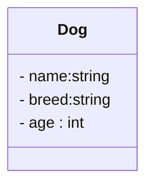
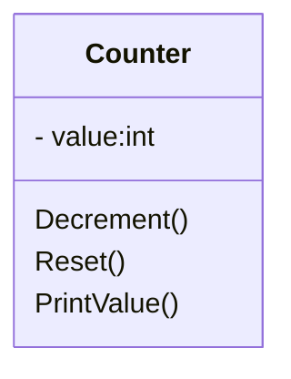

### Task 1
In this exercise, you will be working with a class called `Account` which represents a bank account with a balance.
Your task is to write a program that performs the following steps in exact order:
1. Create an account with a balance of 100.0
2. Deposit 20.0 into the account 
3. Print the balance of the account
##
В этом упражнении вы будете работать с классом `Account`, который представляет банковский счет с балансом.
Ваша задача — написать программу, которая выполняет следующие шаги в точном порядке:
1. Создайте аккаунт с балансом 100,0.
2. Внесите 20,0 на счет.
3. Распечатайте баланс счета.
##
Дар ин машқ шумо бо синфе бо номи `Account` кор хоҳед кард, ки суратҳисоби бонкиро бо тавозун ифода мекунад.
Вазифаи шумо навиштани барномаест, ки қадамҳои зеринро бо тартиби дақиқ иҷро мекунад:
1. Ҳисобро бо бақияи 100,0 эҷод кунед
2. Ба суратҳисоб 20,0 гузоред
3. Бақияи ҳисобро чоп кунед  
**Output** 
```
120 
```
---
### Task 2
In this exercise, you will be working with the same `Account` class as before.
Your task is to write a program that performs the following steps:
1. Create an account named `Heikki's account` with a balance of 1000.0
2. Create an account named `Personal account` with a balance of 0
3. Withdraw 100.0 from `Heikki's account` account
4. Deposit 100.0 into `Personal account` account
5. Print the account information for Heikki's account and then for Personal account using the `ToString()` method.
##
В этом упражнении вы будете работать с тем же классом `Account`, что и раньше.
Ваша задача — написать программу, выполняющую следующие действия:
1. Создайте учетную запись под названием `Heikki's account` с балансом 1000.0.
2. Создайте учетную запись с названием `Personal account` с балансом 0.
3. Вывести 100,0 со счета `Heikki's account`.
4. Внести 100,0 на счет `Personal account`.
5. Распечатайте информацию об учетной записи `Heikki's account`, а затем о `Personal account`, используя метод `ToString()`.
##
Дар ин машқ, шумо бо ҳамон синфи "Ҳисоб" кор хоҳед кард, ки қаблан буд.
Вазифаи шумо ин навиштани барномаест, ки қадамҳои зеринро иҷро мекунад: 
1. Ҳисоби бо номи `Heikki's account` бо тавозуни 1000,0 эҷод кунед
2. Ҳисоби бо номи `Personal account` бо тавозун 0 эҷод кунед
3. Аз ҳисоби `Heikki's account` 100.0 гиред
4. Ба суратҳисоби `Personal account` 100.0 гузоред 
5. Маълумоти ҳисобро барои ҳисоби `Heikki's account` ва сипас барои ҳисоби шахсӣ бо усули `ToString()` чоп кунед.
**Output**
```
Heikki's account balance: 900
Personal account balance: 100
```
---
### Task 3
The `Dog` class represents a dog and has the following fileds:
- `name`: a string that represents the name of the dog.
- `breed`: a string that represents the breed of the dog.
- `age`: an integer that represents the age of the dog.
##
Класс Dog представляет собаку и имеет следующие свойства
- `name`: строка, представляющая имя собаки.
- `breed`: строка, обозначающая породу собаки.
- `age`: целое число, обозначающее возраст собаки.
##
Синфи 'Dog' сагро ифода мекунад ва дорои хосиятҳои зерин аст:
- `name`: сатр, ки номи сагро ифода мекунад.
- `breed`: сатр, ки зоти сагро ифода мекунад.
- `age`: адади бутун, ки синну соли сагро ифода мекунад.
##
The class diagram for the `Dog` class is as follows:
Диаграмма классов класса Dog выглядит следующим образом:
Диаграммаи синф барои синфи 'Dog' чунин аст:

---
### Task 4
The `Product` class represents a store product.
- `name` (string): The name of the product.
- `price` (double): The price of the product.
- `quantity` (int): The quantity of the product.

The `Product` class has a constructor that takes three parameters:
- `name` (string): The name of the product.
- `price` (double): The price of the product.
- `quantity` (int): The quantity of the product.

The `Product` class has a method called `PrintProduct()` that prints the product information in the following format:
##
В классе Product есть метод `PrintProduct()`, который печатает информацию о продукте в следующем формате:
##
Синфи "Маҳсулот" дорои усули `PrintProduct()` мебошад, ки маълумоти маҳсулотро дар формати зерин чоп мекунад:
```
{name}: price {price}: {quantity} pcs
```
For example, if the product is assigned the name Banana, with a price of 1.1 and a quantity of 13, the output would be:
##
Например, если продукту присвоено имя Banana, цена 1,1 и количество 13, результат будет следующим:
##
Масалан, агар ба маҳсулот номи Banana дода шавад, ки нархи он 1,1 ва миқдори 13 аст, натиҷа чунин хоҳад буд:
```
Banana: price 1.1: 13 pcs
```
---
### Task 5
The `Counter` class represents a counter that can be incremented and decremented.

Класс Counter представляет счетчик, который можно увеличивать и уменьшать.

Синфи 'Counter' ҳисобкунакеро ифода мекунад, ки метавонад зиёд ва кам карда шавад.

- `value` (int): The current value of the counter.
##
The `Counter` class has a constructor that takes one parameter:

Класс `Counter` имеет конструктор, принимающий один параметр:

Синфи `Counter` конструктор дорад, ки як параметрро мегирад:

- `value` (int): The initial value of the counter.
##
The `Decrement()` method decrements the value of the counter by 1. If the value of the counter is already 0, it does nothing.

Метод `Decrement()` уменьшает значение счетчика на 1. Если значение счетчика уже равно 0, он ничего не делает.

Усули `Decrement()` арзиши ҳисобкунакро якто кам мекунад. Агар арзиши ҳисобкунак аллакай 0 бошад, он ҳеҷ кор намекунад.
##
The `Reset()` method resets the value of the counter to 0.

Метод Reset() сбрасывает значение счетчика на 0.

Методи 'Reset()' арзиши ҳисобкунакро ба 0 барқарор мекунад.

